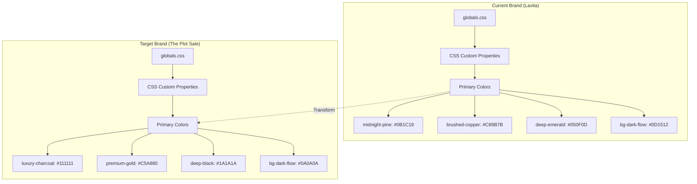
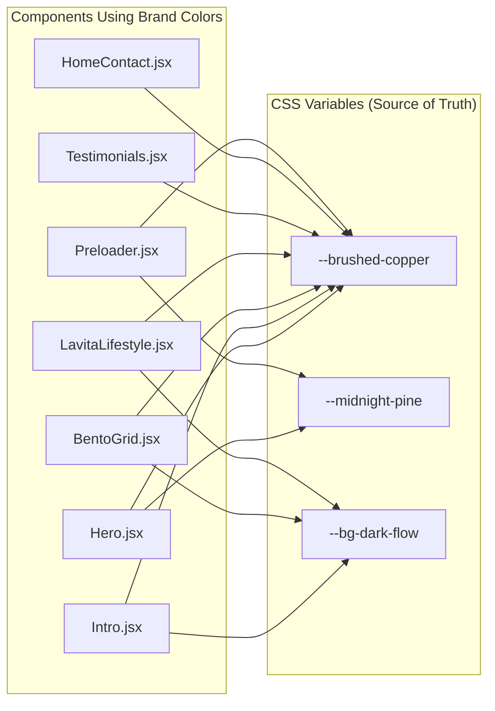

# Design Document: Rebrand to The Plot Sale

## Overview

This document defines the technical approach for rebranding an existing Next.js/Tailwind CSS repository from a mountain resort theme ("Lavita") to a high-end real estate consultancy ("The Plot Sale"). The rebranding focuses on updating the visual identity through color palette transformation while preserving all existing functionality including kinetic scrolling effects, glassmorphism, and framer-motion animations.

The core transformation involves replacing the forest green/copper palette with a luxury charcoal/gold palette, updating CSS custom properties, and ensuring all component references use the new brand colors consistently.

---

## Architecture

### Current State Analysis



### Component Color Dependency Map



---

## Components and Interfaces

### Component 1: CSS Custom Properties (globals.css)

**Purpose**: Define the brand color palette as CSS custom properties for consistent theming across all components.

**Current Interface**:
```css
:root {
  --midnight-pine: #0B1C19;
  --alabaster-mist: #F2F4F6;
  --brushed-copper: #C89B7B;
  --deep-emerald: #050F0D;
  --bg-dark-flow: #0D1512;
  --text-refined-white: #EFEFEF;
}
```

**Target Interface**:
```css
:root {
  --luxury-charcoal: #111111;
  --alabaster-mist: #F2F4F6;
  --premium-gold: #C5A880;
  --deep-black: #1A1A1A;
  --bg-dark-flow: #0A0A0A;
  --text-refined-white: #EFEFEF;
}
```

**Responsibilities**:
- Define primary brand colors
- Provide semantic color aliases
- Support Tailwind CSS @theme inline configuration
- Enable consistent color references across components

### Component 2: Tailwind Theme Configuration

**Purpose**: Map CSS custom properties to Tailwind utility classes for component usage.

**Current Configuration**:
```css
@theme inline {
  --color-midnight-pine: var(--midnight-pine);
  --color-brushed-copper: var(--brushed-copper);
  --color-deep-emerald: var(--deep-emerald);
  --color-bg-dark-flow: var(--bg-dark-flow);
}
```

**Target Configuration**:
```css
@theme inline {
  --color-luxury-charcoal: var(--luxury-charcoal);
  --color-premium-gold: var(--premium-gold);
  --color-deep-black: var(--deep-black);
  --color-bg-dark-flow: var(--bg-dark-flow);
}
```

### Component 3: Glassmorphism Effects

**Purpose**: Maintain the glassmorphism visual effects with updated color palette.

**Current Implementation**:
```css
.glass-morphism {
  background: rgba(15, 37, 34, 0.7);
  backdrop-filter: blur(10px);
  border: 1px solid rgba(200, 155, 123, 0.1);
}
```

**Target Implementation**:
```css
.glass-morphism {
  background: rgba(17, 17, 17, 0.7);
  backdrop-filter: blur(10px);
  border: 1px solid rgba(197, 168, 128, 0.1);
}
```

---

## Data Models

### Color Mapping Model

```typescript
interface ColorMapping {
  oldVariable: string;
  oldHex: string;
  newVariable: string;
  newHex: string;
  usage: string;
}

interface BrandPalette {
  primary: {
    background: string;    // luxury-charcoal: #111111
    accent: string;        // premium-gold: #C5A880
  };
  secondary: {
    darkBg: string;        // deep-black: #1A1A1A
    flowBg: string;        // bg-dark-flow: #0A0A0A
  };
  text: {
    refined: string;       // text-refined-white: #EFEFEF
    light: string;         // text-light: #F5F5F5
  };
}
```

### Component Color Reference Model

```typescript
interface ComponentColorUsage {
  component: string;
  filePath: string;
  colorReferences: ColorReference[];
}

interface ColorReference {
  type: 'hex' | 'variable' | 'rgba';
  value: string;
  lineNumber: number;
  context: string;
}
```

---

## Key Functions with Formal Specifications

### Function 1: transformColorPalette()

```pascal
PROCEDURE transformColorPalette(input)
  INPUT: input CSS file content
  OUTPUT: transformed CSS content
  
  SEQUENCE
    // Step 1: Replace primary background colors
    content ← REPLACE(input, "#0B1C19", "#111111")
    content ← REPLACE(content, "#0D1512", "#0A0A0A")
    content ← REPLACE(content, "#050F0D", "#1A1A1A")
    
    // Step 2: Replace accent colors
    content ← REPLACE(content, "#C89B7B", "#C5A880")
    content ← REPLACE(content, "#d4a98a", "#D4AF37")
    
    // Step 3: Update variable names
    content ← REPLACE(content, "--midnight-pine", "--luxury-charcoal")
    content ← REPLACE(content, "--brushed-copper", "--premium-gold")
    content ← REPLACE(content, "--deep-emerald", "--deep-black")
    
    // Step 4: Update Tailwind color references
    content ← REPLACE(content, "--color-midnight-pine", "--color-luxury-charcoal")
    content ← REPLACE(content, "--color-brushed-copper", "--color-premium-gold")
    content ← REPLACE(content, "--color-deep-emerald", "--color-deep-black")
    
    RETURN content
  END SEQUENCE
END PROCEDURE
```

**Preconditions:**
- `input` is valid CSS content
- All color values are in hex format (#RRGGBB)
- Variable names follow CSS custom property syntax

**Postconditions:**
- All old brand colors replaced with new brand colors
- Variable names updated consistently
- CSS syntax remains valid
- No color values left unchanged

**Loop Invariants:** N/A (single-pass transformation)

### Function 2: updateRgbaReferences()

```pascal
PROCEDURE updateRgbaReferences(content)
  INPUT: content string with rgba() color references
  OUTPUT: content with updated rgba values
  
  SEQUENCE
    // Map old RGB to new RGB values
    // Old copper: rgb(200, 155, 123) → New gold: rgb(197, 168, 128)
    // Old emerald: rgb(15, 37, 34) → New charcoal: rgb(17, 17, 17)
    
    content ← REPLACE(content, "rgba(200, 155, 123", "rgba(197, 168, 128")
    content ← REPLACE(content, "rgba(15, 37, 34", "rgba(17, 17, 17")
    content ← REPLACE(content, "rgba(13, 21, 18", "rgba(10, 10, 10")
    
    RETURN content
  END SEQUENCE
END PROCEDURE
```

**Preconditions:**
- Content contains rgba() function calls
- RGB values match old brand colors

**Postconditions:**
- All rgba references updated to new brand colors
- Alpha values preserved unchanged
- No malformed rgba() functions

### Function 3: validateColorConsistency()

```pascal
PROCEDURE validateColorConsistency(files)
  INPUT: files array of file paths
  OUTPUT: validation report
  
  SEQUENCE
    errors ← EMPTY_ARRAY
    
    FOR each file IN files DO
      content ← READ_FILE(file)
      
      // Check for old brand color references
      IF CONTAINS(content, "#0B1C19") OR CONTAINS(content, "#C89B7B") THEN
        APPEND(errors, {file: file, type: "old_color_found"})
      END IF
      
      IF CONTAINS(content, "--midnight-pine") OR CONTAINS(content, "--brushed-copper") THEN
        APPEND(errors, {file: file, type: "old_variable_found"})
      END IF
      
      // Check for Tailwind class references
      IF CONTAINS(content, "bg-midnight-pine") OR CONTAINS(content, "text-brushed-copper") THEN
        APPEND(errors, {file: file, type: "old_tailwind_class"})
      END IF
    END FOR
    
    RETURN errors
  END SEQUENCE
END PROCEDURE
```

**Preconditions:**
- All files exist and are readable
- Content is text-based (CSS, JSX, JS)

**Postconditions:**
- Returns array of validation errors
- Empty array indicates successful rebrand
- Each error includes file path and error type

**Loop Invariants:**
- All previously checked files remain validated
- Error count monotonically increases

---

## Algorithmic Pseudocode

### Main Rebranding Algorithm

```pascal
ALGORITHM executeRebrand(projectRoot)
INPUT: projectRoot path to project directory
OUTPUT: rebrand result with status

BEGIN
  ASSERT projectRoot EXISTS
  ASSERT isNextJsProject(projectRoot) = true
  
  // Phase 1: Update CSS Custom Properties
  globalsPath ← projectRoot + "/app/globals.css"
  globalsContent ← READ_FILE(globalsPath)
  
  ASSERT globalsContent IS NOT NULL
  
  transformedGlobals ← transformColorPalette(globalsContent)
  transformedGlobals ← updateRgbaReferences(transformedGlobals)
  
  WRITE_FILE(globalsPath, transformedGlobals)
  
  // Phase 2: Update Component Files
  componentFiles ← FIND_FILES(projectRoot + "/components", "*.jsx")
  
  FOR each file IN componentFiles DO
    ASSERT file EXISTS
    
    content ← READ_FILE(file)
    updatedContent ← updateComponentColors(content)
    
    WRITE_FILE(file, updatedContent)
  END FOR
  
  // Phase 3: Update Layout and Metadata
  layoutPath ← projectRoot + "/app/layout.jsx"
  layoutContent ← READ_FILE(layoutPath)
  updatedLayout ← updateMetadata(layoutContent)
  WRITE_FILE(layoutPath, updatedLayout)
  
  // Phase 4: Validation
  allFiles ← CONCAT(globalsPath, componentFiles, layoutPath)
  errors ← validateColorConsistency(allFiles)
  
  IF LENGTH(errors) > 0 THEN
    RETURN {status: "warning", errors: errors}
  END IF
  
  ASSERT validateColorConsistency(allFiles) = EMPTY_ARRAY
  
  RETURN {status: "success", errors: EMPTY_ARRAY}
END
```

**Preconditions:**
- projectRoot is a valid Next.js project directory
- All target files exist and are writable
- Backup of original files exists (recommended)

**Postconditions:**
- All brand colors updated to new palette
- No old brand color references remain
- All animations and effects preserved
- Application builds and runs successfully

**Loop Invariants:**
- All processed files maintain valid syntax
- Color transformation is idempotent

---

## Example Usage

### CSS Variable Transformation

```css
/* BEFORE: Lavita Brand */
:root {
  --midnight-pine: #0B1C19;
  --brushed-copper: #C89B7B;
  --bg-dark-flow: #0D1512;
}

/* AFTER: The Plot Sale Brand */
:root {
  --luxury-charcoal: #111111;
  --premium-gold: #C5A880;
  --bg-dark-flow: #0A0A0A;
}
```

### Component Color Update

```jsx
// BEFORE: Hero.jsx with Lavita colors
<div className="bg-[#C89B7B] text-black">
  <span className="text-[#0B1C19]">Explore Below</span>
</div>

// AFTER: Hero.jsx with The Plot Sale colors
<div className="bg-[#C5A880] text-black">
  <span className="text-[#111111]">Explore Below</span>
</div>
```

### Glassmorphism Update

```css
/* BEFORE */
.glass-morphism {
  background: rgba(15, 37, 34, 0.7);
  border: 1px solid rgba(200, 155, 123, 0.1);
}

/* AFTER */
.glass-morphism {
  background: rgba(17, 17, 17, 0.7);
  border: 1px solid rgba(197, 168, 128, 0.1);
}
```

---

## Correctness Properties

### Property 1: Color Completeness

```
∀ file ∈ ProjectFiles:
  ∀ colorReference ∈ file:
    (colorReference.oldColor ∈ OldPalette) ⟹
    (colorReference.newColor ∈ NewPalette)
```

Every color reference in the project must be transformed from the old palette to the new palette.

### Property 2: Variable Name Consistency

```
∀ cssFile ∈ CSSFiles:
  ∀ variable ∈ cssFile:
    (variable.name = "midnight-pine") ⟹ (variable.name' = "luxury-charcoal") ∧
    (variable.name = "brushed-copper") ⟹ (variable.name' = "premium-gold")
```

All CSS custom property names must be renamed consistently.

### Property 3: Animation Preservation

```
∀ animation ∈ Animations:
  animation.properties \ ColorProperties = animation.properties' \ ColorProperties
```

All animation properties except colors must remain unchanged.

### Property 4: Build Integrity

```
build(project) = success ⟺
  ∀ file ∈ project:
    syntaxValid(file) ∧
    importsResolved(file) ∧
    typesValid(file)
```

The project must build successfully after rebranding.

---

## Error Handling

### Error Scenario 1: Incomplete Color Replacement

**Condition**: Some files still contain old brand color references after transformation.

**Response**: 
- Log warning with file path and line number
- Continue processing remaining files
- Generate report of incomplete transformations

**Recovery**:
- Run validation pass to identify remaining references
- Apply targeted fixes to specific files
- Re-run validation until clean

### Error Scenario 2: Invalid CSS Syntax

**Condition**: CSS transformation produces invalid syntax.

**Response**:
- Abort write operation
- Restore from backup
- Log error with transformation details

**Recovery**:
- Review transformation rules
- Apply manual fix to problematic file
- Resume automated transformation

### Error Scenario 3: Build Failure

**Condition**: Application fails to build after rebranding.

**Response**:
- Capture build error output
- Identify affected components
- Check for broken imports or references

**Recovery**:
- Fix syntax errors in affected files
- Verify all imports resolve correctly
- Re-run build process

---

## Testing Strategy

### Unit Testing Approach

Test individual color transformation functions in isolation:

1. **Color Mapping Tests**
   - Verify hex color replacement accuracy
   - Test rgba() transformation
   - Validate variable name changes

2. **CSS Parsing Tests**
   - Test CSS custom property extraction
   - Verify @theme inline block parsing
   - Test nested rule preservation

3. **Component Update Tests**
   - Test JSX attribute updates
   - Verify className preservation
   - Test inline style updates

### Property-Based Testing Approach

**Property Test Library**: fast-check

**Properties to Test**:

1. **Idempotency Property**: Applying the transformation twice produces the same result as applying it once.

```javascript
fc.property(fc.string(), (content) => {
  const once = transformColors(content);
  const twice = transformColors(once);
  return once === twice;
});
```

2. **Color Preservation Property**: Non-brand colors remain unchanged.

```javascript
fc.property(arbitraryColor(), (color) => {
  if (!isBrandColor(color)) {
    return transformColors(color) === color;
  }
});
```

3. **Syntax Validity Property**: Transformed CSS remains syntactically valid.

```javascript
fc.property(cssContent(), (css) => {
  const transformed = transformColors(css);
  return isValidCSS(transformed);
});
```

### Integration Testing Approach

1. **Build Verification**: Run `npm run build` after transformation to verify no build errors.

2. **Visual Regression**: Compare screenshots before and after rebranding to verify visual consistency.

3. **Animation Testing**: Verify all framer-motion animations still trigger correctly with new colors.

---

## Performance Considerations

### Transformation Performance

- **Single-Pass Processing**: Process each file only once to minimize I/O operations
- **In-Memory Transformation**: Load file content into memory, transform, then write once
- **Parallel Processing**: Process independent component files in parallel where possible

### Runtime Performance

- **CSS Variable Usage**: Using CSS custom properties ensures browser can optimize color references
- **No Additional JavaScript**: Color changes are purely CSS-based, no runtime JavaScript overhead
- **Animation Performance Preserved**: All existing animation optimizations (will-change, GPU acceleration) remain intact

---

## Security Considerations

### Input Validation

- Validate all file paths before reading/writing
- Ensure transformed content doesn't introduce XSS vulnerabilities
- Verify CSS content doesn't contain malicious patterns

### Backup Strategy

- Create backup of original files before transformation
- Store backups in separate directory to prevent accidental overwrites
- Implement rollback capability for failed transformations

---

## Dependencies

### Runtime Dependencies (Unchanged)

| Package | Version | Purpose |
|---------|---------|---------|
| next | ^16.0.7 | Next.js framework |
| react | 19.2.0 | React library |
| framer-motion | ^12.23.25 | Animation library |
| gsap | ^3.13.0 | Scroll animations |
| lenis | ^1.3.15 | Smooth scrolling |
| tailwindcss | ^4 | CSS framework |

### Development Dependencies (Unchanged)

| Package | Version | Purpose |
|---------|---------|---------|
| eslint | ^9 | Linting |
| eslint-config-next | ^16.0.7 | Next.js ESLint config |

### New Dependencies

None required. The rebranding is purely a content transformation, not a feature addition.

---

## Files to Modify

### Primary Files

| File | Changes |
|------|---------|
| `app/globals.css` | Update CSS custom properties, @theme inline, glassmorphism classes |
| `app/layout.jsx` | Update metadata (title, description) |
| `components/home/Hero.jsx` | Update inline color references |
| `components/home/Intro.jsx` | Update inline color references |
| `components/home/BentoGrid.jsx` | Update inline color references |
| `components/home/LavitaLifestyle.jsx` | Update inline color references |
| `components/home/Testimonials.jsx` | Update inline color references |
| `components/home/HomeContact.jsx` | Update inline color references |
| `components/Preloader.jsx` | Update inline color references |

### Color Reference Summary

| Old Color | New Color | Usage |
|-----------|-----------|-------|
| `#0B1C19` | `#111111` | Primary background |
| `#0D1512` | `#0A0A0A` | Dark flow background |
| `#050F0D` | `#1A1A1A` | Deep black |
| `#C89B7B` | `#C5A880` | Primary accent (gold) |
| `#d4a98a` | `#D4AF37` | Hover accent |
| `rgba(200, 155, 123, X)` | `rgba(197, 168, 128, X)` | Semi-transparent accents |
| `rgba(15, 37, 34, X)` | `rgba(17, 17, 17, X)` | Semi-transparent backgrounds |